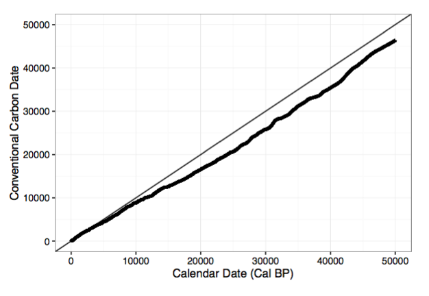
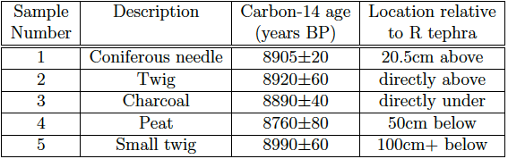
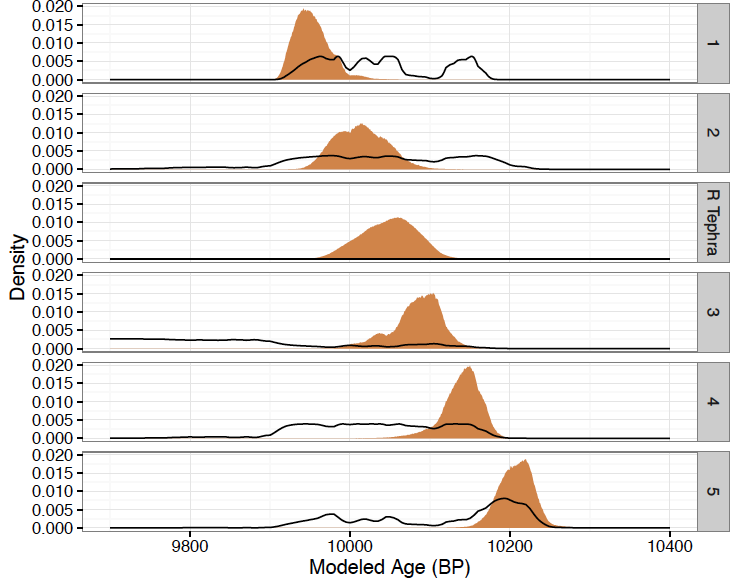

# Analyzing Radiocarbon Data with Temporal Order Constraints

This is the Repository for my Senior Thesis in Mathematics-Statistics at Reed College. It uses the Metropolis-Hastings algorithm to estimate the ages of six samples found at Mt. Rainier National Park. The [full version](./RTephraThesisFull.pdf) of my thesis is available, as is the [R script](./RealRTephra.R) that can be used to replicate the analysis.

## Background

The ratio of carbon-14 to carbon-12 in the atmosphere is not constant over time, so measuring the carbon ratio in living things from the present is not a good estimate for the initial carbon ratio of a sample. Scientists who want their
samples carbon dated send them to a lab and receive a carbon date along with an estimated standard deviation. While this carbon date is a function of the calendar year from which the sample originated, the exponential constant is unknown, making it difficult to find the true age of a sample.

*The most recent (2013) calibration curve relating conventional carbon
dates to calendar year (BP) shown with the identity line.*

In order to make determining calendar years from carbon dates possible, calibration curves were created. The calibration curve used here, IntCal13, spans from 0 to 50,000 BP, where BP stands for before present. The year 0 BP is defined as 1950 and larger values correspond to older ages.

Using the calibration curve, we can calculate a probability distribution on calendar years for a single conventional carbon date. However, scientists often have information about their samples beyond the carbon dates measured in a lab, which can help to narrow the distribution of possible ages. Here we deal with getting more accurate approximations of age by incorporating this additional information into the data analysis. Specifically, we tackle the problem where multiple samples are found at a single site with some samples found above or below others in the sediment, where samples found nearer to the surface of the earth are assumed to be younger compared to samples found deeper in the sediment. This analysis was originally suggested by Buck et al. [1992].

Using a Bayesian analysis with the temporal ordering of multiple samples as a prior condition, we use a Markov Chain Monte Carlo method (the Metropolis-Hastings Algorithm) to come up with age approximations for all samples, including one sample for which age is determined by
temporal ordering alone.

## Data

The data for this thesis comes from the Mount Rainier National Park in Washington state and is an attempt to date a tephra deposit found in the park known as the R tephra. Tephra are the ash and rock fragments produced by volcanoes while they are erupting. There several tephra deposits found within the park. The R tephra in particular is the oldest of many tephra associated with Mount Rainier during the Holocene era (the current geological epoch).

Tephra cannot be carbon-dated directly. Since tephra are essentially volcanic ash, they do not have a carbon-14 to carbon-12 ratio in equilibrium with the atmosphere when first formed, as they are neither living nor produced by a living thing. Instead, tephra are dated by measuring the carbon ages of samples near around them. This
dataset includes five samples, two above and three below the R tephra (where above means more recent). The data is summarized below. Note that the carbon-14 dates do not adhere to the ordering implied by the stratigraphic evidence.

## Results

To date the R tephra, the simulation was run for two million trials. The proposal distribution was normal with a variance of 625. The variance was chosen to be lower here than in the previous applications without the R Tephra datapoint since at every iteration, including the R tephra constraint already restricts the values each component can take on. The rejection rate was approximately 20%. The first 10,000 trials were discarded as burn-in and then every fifth trial was sampled.

*Posterior densities for the analysis with the R tephra boundary included. The line plots are densities based on individual numerical integrations without the ordered prior.*

As opposed to the analysis without the R tephra, the densities for the carbon dated samples are slightly flatter (the 95% credible intervals are wider). The samples found above the R tephra have more density in younger ages than before while samples found below the R tephra have more density in older ages. This is as expected since, in any given iteration of the simulation, we required the ages of the samples to be strictly ordered.

Overall, the mean and median ages (BP) of the R tephra were found to be 10048 and 10050, respectively.
